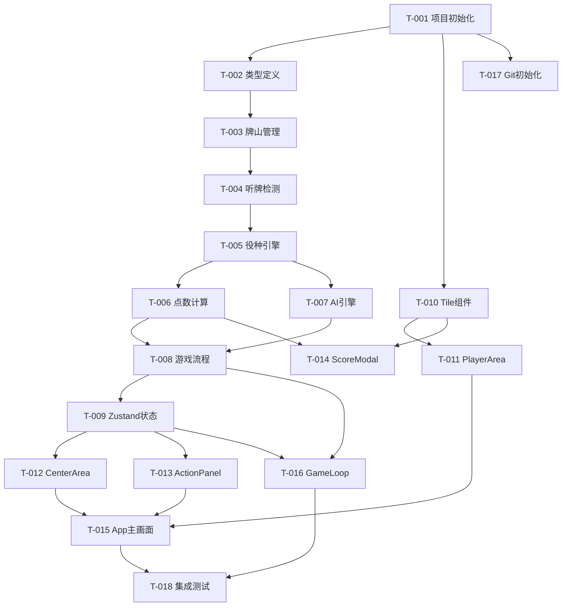

# 开发任务规格文档

## 摘要

- **任务总数**：18 个
- **前端任务**：8 个
- **引擎任务**：8 个
- **工程任务**：2 个
- **关键路径**：T-001 → T-002 → T-003 → T-004 → T-005 → T-009 → T-013
- **预估复杂度**：高

---

## 阶段一：工程基础（M0）

### Task T-001：项目初始化

**类型**：创建

**目标文件**：
| 文件路径 | 操作 | 说明 |
|----------|------|------|
| `package.json` | 创建 | Vite+React+TS 依赖 |
| `vite.config.ts` | 创建 | Vite 配置 |
| `tsconfig.json` | 创建 | TypeScript 严格模式 |
| `tailwind.config.ts` | 创建 | Tailwind 配置 |
| `vitest.config.ts` | 创建 | 测试配置 |
| `.eslintrc.cjs` | 创建 | Airbnb 规范 |
| `.prettierrc` | 创建 | 格式化配置 |
| `.gitignore` | 创建 | Git 忽略文件 |
| `README.md` | 创建 | 项目说明 |

**实现步骤**：
1. 用 Vite 初始化 React+TypeScript 模板
2. 安装依赖：`zustand tailwindcss vitest @testing-library/react`
3. 配置 Tailwind，添加自定义颜色变量（牌桌绿、象牙白等）
4. 配置 ESLint Airbnb 规范
5. 初始化 Git 仓库，创建 .gitignore

**复杂度**：低
**依赖**：无

---

### Task T-002：核心类型定义

**类型**：创建

**目标文件**：
| 文件路径 | 操作 | 说明 |
|----------|------|------|
| `src/engine/types.ts` | 创建 | 全部核心类型 |

**实现步骤**：
1. 定义 `Suit`、`TileValue`、`Tile` 类型
2. 定义 `Wind`、`Player`、`Meld`、`MeldType` 类型
3. 定义 `GamePhase`、`GameState` 类型
4. 定义 `Action`、`ActionType` 类型
5. 定义 `YakuResult`、`ScoreResult` 类型

**测试用例**：`tests/engine/types.test.ts`
- [ ] 所有类型可正确构造，无 TypeScript 错误

**复杂度**：低
**依赖**：T-001

---

## 阶段二：游戏引擎（M1）

### Task T-003：牌山与手牌管理

**类型**：创建

**目标文件**：
| 文件路径 | 操作 | 说明 |
|----------|------|------|
| `src/engine/tiles.ts` | 创建 | 136张牌常量+洗牌 |
| `src/engine/wall.ts` | 创建 | 牌山管理 |
| `src/engine/hand.ts` | 创建 | 手牌操作 |

**实现步骤**：
1. `tiles.ts`：生成完整 136 张牌（万/饼/索各36张+字牌28张），Fisher-Yates 洗牌
2. `wall.ts`：摸牌、岭上牌（王牌区14张）、宝牌翻示
3. `hand.ts`：手牌排序（按花色+数值）、副露处理、暗杠处理

**测试用例**：`tests/engine/tiles.test.ts`
- [ ] 生成的牌山恰好 136 张
- [ ] 每种牌恰好 4 张
- [ ] 洗牌后顺序随机（多次调用不同）
- [ ] 摸牌后牌山减少1张
- [ ] 手牌排序正确（万<饼<索<字）

**复杂度**：低
**依赖**：T-002

---

### Task T-004：听牌检测

**类型**：创建

**目标文件**：
| 文件路径 | 操作 | 说明 |
|----------|------|------|
| `src/engine/tenpai.ts` | 创建 | 听牌检测+待牌计算 |

**实现步骤**：
1. 实现标准和牌型判定（4面子+1雀头）的递归拆分
2. 实现七对子和牌型判定
3. 实现国士无双判定（可选）
4. `isTenpai(hand: Tile[]): boolean` - 判断13张牌是否听牌
5. `getWaitingTiles(hand: Tile[]): Tile[]` - 返回所有待牌
6. `canWin(hand: Tile[], tile: Tile): boolean` - 判断加入某张牌是否和牌

**测试用例**：`tests/engine/tenpai.test.ts`
- [ ] 标准 4 面子+1 雀头听牌正确识别
- [ ] 七对子听牌正确识别
- [ ] 不听牌的手牌返回 false
- [ ] 双碰、单钓、边张、嵌张等待牌形式均正确
- [ ] 和牌判定：加入和牌张后返回 true

**复杂度**：高
**依赖**：T-003

---

### Task T-005：役种判定引擎

**类型**：创建

**目标文件**：
| 文件路径 | 操作 | 说明 |
|----------|------|------|
| `src/engine/yaku/index.ts` | 创建 | 役种判定总入口 |
| `src/engine/yaku/basic.ts` | 创建 | 基础役种 |
| `src/engine/yaku/special.ts` | 创建 | 特殊役种（七对子等） |

**实现步骤**：
1. `basic.ts` 实现以下役种判定函数：
   - `isRiichi` 立直
   - `isTsumo` 门清自摸
   - `isTanyao` 断幺九
   - `isPinfu` 平和
   - `isIipeiko` 一盃口
   - `isYakuhai` 役牌（三元牌/场风/自风）
   - `isIttsu` 一气通贯
   - `isSanshokuDoujun` 三色同顺
   - `isChanta` 混全带幺九
   - `isToitoi` 对对和
   - `isSanshokuDoukou` 三色同刻
   - `isHonitsu` 混一色
   - `isChinitsu` 清一色
   - `isShousangen` 小三元
   - `isHonroutou` 混老头
   - `isHaitei` 海底摸月
   - `isHoutei` 河底捞鱼
   - `isRinshan` 岭上开花
   - `isChankan` 抢杠
2. `special.ts` 实现：
   - `isChiitoitsu` 七对子
3. `index.ts`：`calculateYaku(state, player, winTile)` 返回所有成立役种数组

**测试用例**：`tests/engine/yaku.test.ts`
- [ ] 断幺九：手牌全为2-8数牌时成立
- [ ] 断幺九：含幺九牌时不成立
- [ ] 平和：4顺子+序数牌雀头+两面待时成立
- [ ] 役牌：含中发白刻子时成立
- [ ] 七对子：7对不同牌时成立
- [ ] 混一色：只有一种数牌+字牌时成立
- [ ] 清一色：只有一种数牌时成立
- [ ] 复合役：断幺九+平和+一盃口同时成立

**复杂度**：高（最核心模块）
**依赖**：T-004

---

### Task T-006：点数计算

**类型**：创建

**目标文件**：
| 文件路径 | 操作 | 说明 |
|----------|------|------|
| `src/engine/yaku/scoring.ts` | 创建 | 符数+番数+点数计算 |

**实现步骤**：
1. 符数计算（`calculateFu`）：
   - 基本符：门清荣和30符/自摸20符/副露和20符
   - 雀头符：役牌雀头2符/非役牌0符
   - 面子符：明刻/暗刻/明杠/暗杠按幺九/非幺九分类
   - 和牌符：门清荣和10符/自摸2符/边张/嵌张/单钓2符
   - 平和自摸例外（20符）
   - 七对子例外（25符）
2. 番数→点数基本点计算：`基本点 = 符 × 2^(番+2)`
3. 亲家/子家点数表：满贯8000/跳满12000/倍满16000/三倍满24000/役满32000
4. 支付计算：荣和（一人支付）/ 自摸（亲家/子家分开计算）

**测试用例**：`tests/engine/scoring.test.ts`
- [ ] 30符3番 子家荣和 = 3900点
- [ ] 30符4番 子家 = 满贯 7700点
- [ ] 平和断幺自摸 20符2番 正确
- [ ] 亲家荣和点数 = 子家 × 1.5（取整）
- [ ] 役满32000点正确

**复杂度**：高
**依赖**：T-005

---

### Task T-007：AI 决策引擎

**类型**：创建

**目标文件**：
| 文件路径 | 操作 | 说明 |
|----------|------|------|
| `src/engine/ai/discard.ts` | 创建 | AI 出牌策略 |
| `src/engine/ai/action.ts` | 创建 | AI 鸣牌决策 |
| `src/engine/ai/index.ts` | 创建 | AI 总入口 |

**实现步骤**：
1. `discard.ts`：
   - 计算手牌中每张牌的「有效牌数」（去掉该牌后听牌进张数）
   - 优先出有效牌数最少的孤立牌
   - 超时兜底：2000ms 后强制出第一张牌
2. `action.ts`：
   - 可以和牌时：100% 和
   - 可以碰/杠但不影响听牌：概率决策（简单AI 50%碰）
   - [TM_CONTINUE_ACK:tmc-rhvsdx]
[TM_CONTINUE_START:tmc-rhvsdx]
 吃牌：只在能完成顺子且不影响和牌时才吃
3. `index.ts`：`getAIAction(state, playerIndex): Action` 带2000ms超时兜底

**测试用例**：`tests/engine/ai.test.ts`
- [ ] AI 持有14张牌时能返回合法出牌
- [ ] AI 可以和牌时动作为 tsumo/ron
- [ ] AI 超时（mock 2s）后返回默认出牌

**复杂度**：中
**依赖**：T-005

---

### Task T-008：游戏主流程控制

**类型**：创建

**目标文件**：
| 文件路径 | 操作 | 说明 |
|----------|------|------|
| `src/engine/game.ts` | 创建 | 游戏流程状态机 |

**实现步骤**：
1. `initGame(settings)` 初始化游戏状态（洗牌、发牌、确定庄家）
2. `drawTile(state, playerIndex)` 摸牌逻辑
3. `discardTile(state, playerIndex, tile)` 出牌逻辑，触发其他玩家鸣牌检测
4. `processAction(state, playerIndex, action)` 处理吃/碰/杠/荣/跳过
5. `checkRoundEnd(state)` 检测流局条件（牌山摸完）
6. `nextRound(state)` 轮庄逻辑

**测试用例**：`tests/engine/game.test.ts`
- [ ] 初始发牌后各家手牌13张
- [ ] 摸牌后手牌14张，牌山减少
- [ ] 出牌后河牌增加，手牌回到13张
- [ ] 流局：牌山耗尽时 phase 变为 roundEnd

**复杂度**：高
**依赖**：T-006、T-007

---

## 阶段三：状态管理（M2）

### Task T-009：Zustand 游戏状态

**类型**：创建

**目标文件**：
| 文件路径 | 操作 | 说明 |
|----------|------|------|
| `src/store/gameStore.ts` | 创建 | 游戏全局状态 |
| `src/store/settingsStore.ts` | 创建 | 设置状态 |

**实现步骤**：
1. `gameStore`：包装 `game.ts` 所有方法为 Zustand actions
2. 使用 `immer` 中间件保证不可变更新
3. `settingsStore`：难度选择、局型选择（东风/东南）
4. 导出 `useGameStore`、`useSettingsStore` hooks

**复杂度**：低
**依赖**：T-008

---

## 阶段四：UI 组件（M2）

### Task T-010：麻将牌组件（Tile）

**类型**：创建

**目标文件**：
| 文件路径 | 操作 | 说明 |
|----------|------|------|
| `src/utils/tileRender.ts` | 创建 | Unicode/文字映射 |
| `src/components/Tile/index.tsx` | 创建 | 牌组件 |
| `src/components/Tile/TileBack.tsx` | 创建 | 牌背组件 |

**实现步骤**：
1. `tileRender.ts`：万子用「１万」形式，饼子用「①」Unicode，索子用「1竹」，字牌用「東南西北中發白」
2. `Tile`：接收 `tile`、`selected`、`onClick`、`size` props
3. 象牙白背景+立体阴影+选中时上移8px+金色边框
4. `TileBack`：深色牌背，用于对手手牌

**测试用例**：`tests/components/Tile.test.tsx`
- [ ] 渲染万子1时显示「１万」
- [ ] selected=true 时有 translateY(-8px) 样式
- [ ] 点击时调用 onClick 回调

**复杂度**：低
**依赖**：T-001

---

### Task T-011：玩家区域组件（PlayerArea）

**类型**：创建

**目标文件**：
| 文件路径 | 操作 | 说明 |
|----------|------|------|
| `src/components/GameBoard/PlayerArea.tsx` | 创建 | 单个玩家区域 |

**实现步骤**：
1. Props：`player`、`position`（top/left/right/bottom）、`isCurrentTurn`
2. bottom（玩家本人）：正面手牌，可点击选择出牌
3. top/left/right：背面手牌，数量显示
4. 显示河牌（最多3行6列）
5. 显示副露（吃/碰/杠的牌组）
6. 当前回合边框高亮

**复杂度**：中
**依赖**：T-010

---

### Task T-012：中央信息区（CenterArea）

**类型**：创建

**目标文件**：
| 文件路径 | 操作 | 说明 |
|----------|------|------|
| `src/components/GameBoard/CenterArea.tsx` | 创建 | 中央牌桌信息 |

**实现步骤**：
1. 显示场风（東/南）、局数、本场数
2. 显示宝牌指示牌（最多5张）
3. 显示剩余牌山数量
4. 显示立直棒（100点棒图标）

**复杂度**：低
**依赖**：T-009

---

### Task T-013：操作面板（ActionPanel）

**类型**：创建

**目标文件**：
| 文件路径 | 操作 | 说明 |
|----------|------|------|
| `src/components/ActionPanel/index.tsx` | 创建 | 操作按钮面板 |

**实现步骤**：
1. 接收 `availableActions` 数组，动态渲染可用按钮
2. 荣/自摸（金色）、碰/杠（橙色）、吃（蓝色）、跳过（灰色）
3. 吃牌时弹出组合选择子面板
4. 5秒倒计时进度条，超时自动跳过
5. 按钮出现时弹入动画

**复杂度**：中
**依赖**：T-009

---

### Task T-014：和牌结算弹窗（ScoreModal）

**类型**：创建

**目标文件**：
| 文件路径 | 操作 | 说明 |
|----------|------|------|
| `src/components/ScoreModal/index.tsx` | 创建 | 结算弹窗 |

**实现步骤**：
1. 显示和牌方式（荣和/自摸）+玩家名
2. 展示完整手牌（含和牌张，高亮）
3. 列出所有役种+番数
4. 显示符数+番数合计+点数
5. 显示支付明细（各家支付多少）
6. 「继续」按钮触发下一局

**复杂度**：中
**依赖**：T-006、T-010

---

### Task T-015：开始界面与游戏主画面（App）

**类型**：创建

**目标文件**：
| 文件路径 | 操作 | 说明 |
|----------|------|------|
| `src/components/GameBoard/index.tsx` | 创建 | 牌桌主组件 |
| `src/App.tsx` | 修改 | 路由：开始界面↔游戏界面 |
| `src/index.css` | 修改 | 全局样式+CSS变量 |

**实现步骤**：
1. `App.tsx`：根据游戏phase显示开始界面或游戏界面
2. `GameBoard`：组合 PlayerArea×4 + CenterArea + ActionPanel
3. 响应式布局：桌面CSS Grid四方向，手机端压缩布局
4. `index.css`：定义所有 CSS 变量（颜色/字体/间距）

**复杂度**：中
**依赖**：T-011、T-012、T-013

---

### Task T-016：游戏主循环 Hook

**类型**：创建

**目标文件**：
| 文件路径 | 操作 | 说明 |
|----------|------|------|
| `src/hooks/useGameLoop.ts` | 创建 | 游戏主循环 |
| `src/hooks/usePlayerAction.ts` | 创建 | 玩家操作 Hook |

**实现步骤**：
1. `useGameLoop`：监听 gamePhase，AI 回合自动触发 AI 决策（带延迟模拟思考）
2. `usePlayerAction`：封装玩家出牌、立直、鸣牌操作
3. AI 思考延迟：随机 800-1500ms，模拟真实感

**复杂度**：中
**依赖**：T-008、T-009

---

## 阶段五：Git 初始化与工程收尾（M3）

### Task T-017：Git 初始化与首次提交

**类型**：创建

**目标文件**：
| 文件路径 | 操作 | 说明 |
|----------|------|------|
| `.gitignore` | 创建 | 忽略 node_modules 等 |
| `README.md` | 创建 | 项目说明文档 |

**实现步骤**：
1. `git init`
2. 创建规范 `.gitignore`（node_modules / dist / .env）
3. 写 README（项目介绍、技术栈、本地运行、部署说明）
4. `git add .` + `git commit -m "chore: init project with Vite+React+TypeScript"`
5. 说明如何 push 到 GitHub

**复杂度**：低
**依赖**：T-001

---

### Task T-018：集成测试与构建验证

**类型**：验证

**实现步骤**：
1. 运行 `npm run test` 确认所有单元测试通过
2. 运行 `npm run build` 确认生产构建无报错
3. 运行 `npm run preview` 验证生产包可正常运行

**复杂度**：低
**依赖**：全部任务

---

## 任务依赖图

---

## 实现前检查清单

- [ ] Node.js 18+ 已安装
- [ ] <thinking>
Continuing the truncated tool call for tasks.md.
</thinking>

[TM_CONTINUE_ACK:tmc-78hww6]
[TM_CONTINUE_START:tmc-78hww6]
 npm 9+ 已安装
- [ ] Git 已安装
- [ ] 了解 React + TypeScript 基础
- [ ] 已阅读 architecture.md 和 prd.md
